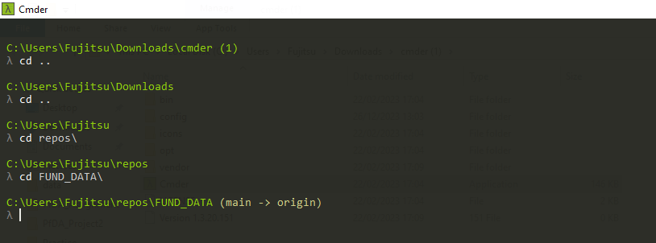
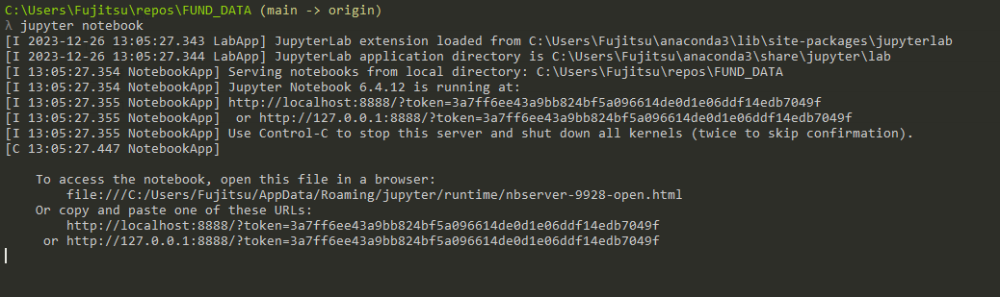
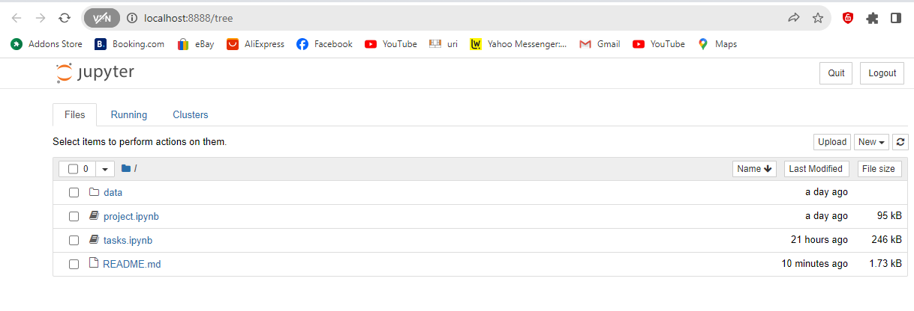

# FUNDAMENTALS of DATA ANALYTICS

# PROJECT and Tasks by Michael Allen
## INTRODUCTION
The repository contains two sections:
- Tasks
- Project on Fisher's Iris data set.
Fisher's Iris data set is a multivariate data set introduced by Ronald Fisher in 1936, as an example of linear discriminant analysis i.e. a method used in statistics to find a linear combination of features that characterizes or separates two or more classes of objects or events. In this study, Fisher wished to investigate if the species of an Iris flower could be identified by examining its petal and sepal length and width.

## PURPOSE
 • The purpose of the project is to create a notebook investigating the variables and
data points within the well-known iris flower data set associated
with Ronald A Fisher.
- The purpose of the tasks section is to perform 5 tasks successfully.

## CONTENTS
### Contents of Tasks
All 5 tasks should be completed in a single notebook called tasks.ipynb.
The 5 tasks are as follows:
- Verify, using Python, that the conjecture is true for
the first 10,000 positive integers.
- Give an overview of the famous penguins data set explaining the types of variables it contains.
-  For each of the variables in the penguins data set 3 suggest what probability distribution from the numpy random distributions list is the most appropriate to model the variable.
-  Suppose you are flipping two coins, each with a probability p of giving heads. Plot the entropy of the total number of heads versus p.
-  Create an appropriate individual plot for each of the variables in the penguin data set.

### Contents of Project 
• In the project.ipynb notebook, I discuss the classification of each
variable within the data set according to common variable types
and scales of measurement in mathematics, statistics, and Python.
• Select, demonstrate, and explain the most appropriate summary
statistics to describe each variable.
• Select, demonstrate, and explain the most appropriate plot(s) for
each variable
• The notebook follows a cohesive narrative about the data
set

## INSTRUCTIONS

## How to clone and run notebook
1. Download and Install Anaconda. Here's the link:
https://www.anaconda.com/download/

2) Download and Install Visual Studio Code. Here's the link:
https://code.visualstudio.com/

3) Clone Repository as follows:
- On GitHub.com, navigate to the main page of the repository.
  
- Above the list of files, click Code.
  
  
- Copy the URL for the repository.
  
  
- Open Git Bash.
  
- Change the current working directory to the location where you want the cloned directory.
  
- Type git clone, and then paste the URL you copied earlier.
  
- Press Enter to create your local clone.
  
The steps for cloning a repository are detailed in the link below:
https://docs.github.com/en/repositories/creating-and-managing-repositories/cloning-a-repository

5) Open Repository in Visual Studio Code
https://code.visualstudio.com/docs/sourcecontrol/intro-to-git#_open-a-git-repository

6) Alternatively you can open the repository in a Jupyter notebook.
Refer to these snapshots for a step-by-step guide:

Step 1: Change directory. Open FUND_DATA directory.

Step 2: Run command jupyter notebook

Step 3: The notebook opens in a web browser. It contains tasks.ipynb and project,ipynb

## ISSUES
### Troubleshooting cloning errors

https://docs.github.com/en/repositories/creating-and-managing-repositories/troubleshooting-cloning-errors

If you're having trouble cloning a repository, check these common errors.
1. HTTPS cloning errors
 - Check your Git version
 - Ensure the remote is correct
 - Provide an access token
 - Check your permissions
 - Use SSH instead
 
 2. Error: Repository not found
  - Check your spelling
  - Checking your permissions
  - Check your SSH access
  - Check that the repository really exists
  
 3. Error: Remote HEAD refers to nonexistent ref, unable to checkout
