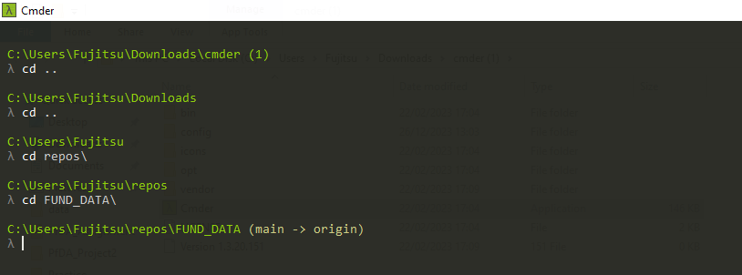
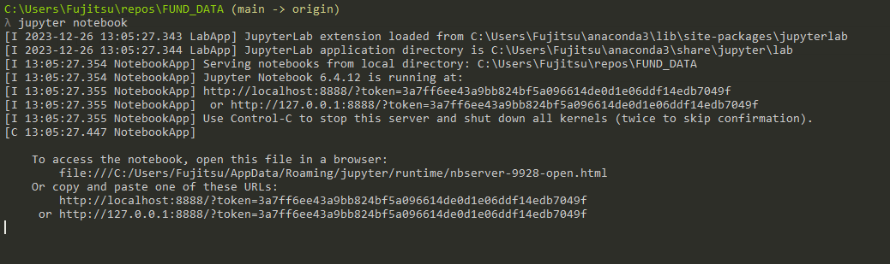
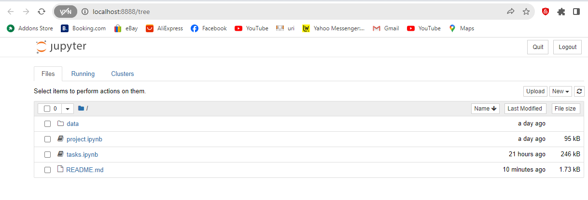

# FUND_DATA

# PROJECT by Michael Allen
## INTRODUCTION
Fisher's Iris data set is a multivariate data set introduced by Ronald Fisher in 1936, as an example of linear discriminant analysis i.e. a method used in statistics to find a linear combination of features that characterizes or separates two or more classes of objects or events. In this study, Fisher wished to investigate if the species of an Iris flower could be identified by examining its petal and sepal length and width.

## PURPOSE
 • The project is to create a notebook investigating the variables and
data points within the well-known iris flower data set associated
with Ronald A Fisher.

## CONTENTS
• In the notebook, you should discuss the classification of each
variable within the data set according to common variable types
and scales of measurement in mathematics, statistics, and Python.
• Select, demonstrate, and explain the most appropriate summary
statistics to describe each variable.
• Select, demonstrate, and explain the most appropriate plot(s) for
each variable
• The notebook should follow a cohesive narrative about the data
set

## INSTRUCTIONS

## How to clone and run notebook
1. Download and Install Anaconda. Here's the link:
https://www.anaconda.com/download/

2)Download and Install Visual Studio Code. Here's the link:
https://code.visualstudio.com/

3) Clone Repository as follows:
https://docs.github.com/en/repositories/creating-and-managing-repositories/cloning-a-repository

4) Open Repository in Visual Studio Code
https://code.visualstudio.com/docs/sourcecontrol/intro-to-git#_open-a-git-repository

5) Alternatively you can open the repository in a Jupyter notebook.
Refer to these snapshots for a step-by-step guide:

Step 1:

Step 2:

Step 3:

